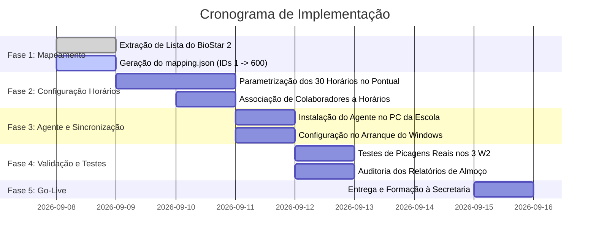

# PLANO DE PROJETO: Implementação Suprema BioStar 2 + Pontualidade.pt

## 1. Sumário Executivo & Objetivos
- **Cliente:** Colégio / Escola Privada.
- **Utilizadores:** 70 colaboradores ativos.
- **Complexidade:** 30 horários de trabalho distintos com pausas de almoço flexíveis e escalonadas.
- **Hardware:** 3x Suprema BioEntry W2 (portões e portas exteriores IP67) + 1x BioMini Plus 2 (USB de secretária).
- **Objetivo Central:** Substituir a tentativa de troca de hardware pela integração direta dos equipamentos existentes na plataforma cloud **pontualidade.pt**, resolvendo de vez o mito do limite de picagens e automatizando os 30 horários.

---

## 2. Cronograma de Fases e Marcos

---

## 3. Detalhe Passo a Passo das Fases

### Fase 1: Mapeamento e Dados dos 70 Colaboradores
1. **Extração:** No BioStar 2 da escola, exportar a lista de utilizadores (ID BioStar, Nome completo).
2. **Correspondência:** Cruzar com a lista de colaboradores existente no Pontualidade.pt (ex: ID Suprema `1` ➔ `workno` `600`).
3. **Ficheiro de Mapeamento:** Preencher o ficheiro `agent/mapping.json` com os 70 pares de IDs.
4. **Critério de Sucesso:** Nenhuma picagem fica com colaborador "Desconhecido".

---

### Fase 2: Os 30 Horários e Motor de Assiduidade
1. **Configuração dos Horários no Pontual:**
   - Criar na tabela `Schedule` os 30 horários com:
     - Hora de entrada prevista e tolerância (ex: 15-20 min).
     - Duração prevista do almoço (ex: 60 min).
     - Horas diárias e semanais contratadas (ex: 35h, 40h).
2. **Associação de Colaboradores:**
   - Associar cada um dos 70 colaboradores ao seu respetivo horário através da tabela `EmployeeSchedule`.
3. **Cálculo de Pausas de Almoço:**
   - O motor de cálculo agrupa as picagens diárias de cada pessoa em pares:
     - 1.ª Picagem: Entrada
     - 2.ª Picagem: Saída para Almoço
     - 3.ª Picagem: Regresso do Almoço
     - 4.ª Picagem: Saída Final
4. **Critério de Sucesso:** Relatório diário calcula as horas efetivas trabalhadas e o tempo real de almoço.

---

### Fase 3: Instalação do Agente no PC da Secretaria
1. **Preparação:** Copiar a pasta `agent/` para o PC da escola (ex: `C:\PontualAgent\`).
2. **Configuração:**
   - `config.json` com URL do teu site (`https://www.pontualidade.pt/api/sync/punches`).
   - Token secreto atribuído à escola (`x-school-token`).
   - Credenciais do BioStar 2 local (`admin` e password local).
3. **Automação:**
   - Criar tarefa no **Agendador de Tarefas do Windows (Task Scheduler)** para executar `iniciar-agente.bat` no arranque do computador com privilégios de sistema.
4. **Critério de Sucesso:** Agente arranca silenciosamente e comunica a cada 30 segundos.

---

### Fase 4: Leitor USB de Secretária (Novos Contratos)
1. Manter o **Suprema USB Agent** ativo no PC da secretária.
2. Na assinatura de novos contratos, a secretária abre a ficha de colaborador no Pontualidade.pt e clica em *"Capturar Impressão Digital"*.
3. O BioMini Plus 2 lê a biometria na secretária e associa ao novo funcionário.
4. O BioStar 2 envia automaticamente a impressão digital para os 3 BioEntry W2 nos portões.

---

### Fase 5: Testes e Validação Final
- [ ] Teste de picagem no W2 do Portão Exterior (comportamento sob chuva/humidade).
- [ ] Teste de múltiplas picagens no mesmo dia (provar que ultrapassa o mito das 2 picagens).
- [ ] Teste de picagem com almoço de 45 min vs 60 min vs 90 min.
- [ ] Verificação da exportação do relatório mensal para Excel e PDF.
- [ ] Validação do mapa de assiduidade pelo departamento financeiro/recursos humanos da escola.

---

## 4. Estrutura Financeira & Manutenção
- **Ano 1:** 1.050 € + IVA já faturados (cobrem a parametrização dos 30 horários, instalação do agente, e 12 meses de subscrição cloud do Pontualidade.pt).
- **Ano 2 em diante:** Renovação anual ou mensalidade de manutenção SaaS para suporte, atualizações e alojamento cloud da escola.
